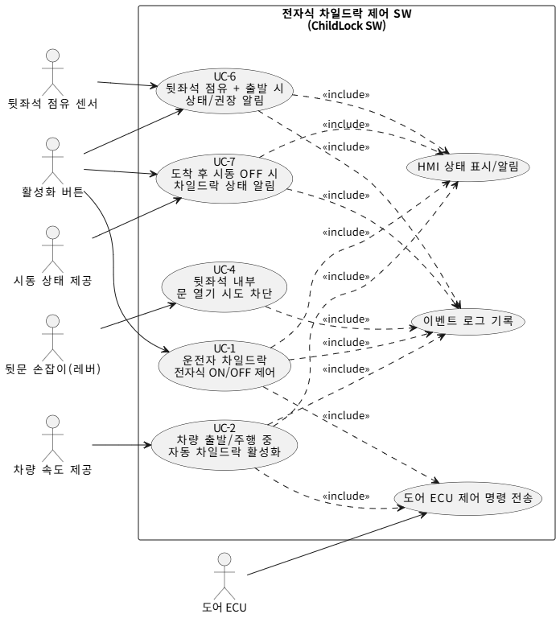
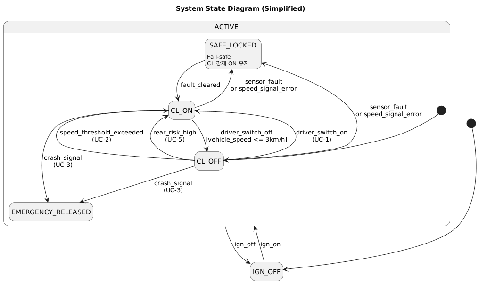
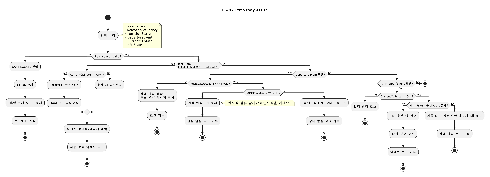

# 📱 전자식 차일드 락 시스템 (MBP-T05)

<div align="center">
  
  <h3>MOBIUS Bootcamp ISO 26262 SW 시뮬레이션 프로젝트</h3>
  <p><b>팀: 전차 </b></p>
</div>

---

## 📝 프로젝트 개요

본 프로젝트는 차량용 기능 안전 표준인 **ISO 26262**를 준수하는 **전자식 차일드 락 시스템(Electronic Child Lock System)** 개발을 목표로 합니다. 차량 속도, 충돌 감지, 후방 위험 접근 등을 지능적으로 판단하여 뒷좌석 승객(아이)의 안전을 최우선으로 확보하는 시스템입니다.

- **목표**: 고신뢰성 및 고안전성을 갖춘 임베디드 차일드 락 제어 SW 구현
- **핵심 가치**: ISO 26262 기능 안전 준수, MISRA C 코딩 표준 적용, TDD 기반의 철저한 검증

---

## 🚀 주요 기능 (Key Features)

시스템은 7가지 핵심 유스케이스를 중심으로 설계되었으며, 두 개의 주요 기능 그룹으로 나뉩니다.

### **FG-01: 도어 잠금 및 해제 제어**

- **UC-1: 전자식 제어** – 운전자가 스위치를 통해 차일드 락을 수동으로 ON/OFF 제어합니다.
- **UC-2: 자동 활성화** – 차량 속도가 3km/h를 초과하면 자동으로 잠금을 수행합니다.
- **UC-3: 비상 해제** – 사고(충돌) 발생 시 뒷좌석 승객의 탈출을 위해 즉시 잠금을 해제합니다.
- **UC-4: 개방 차단** – 차일드 락 활성 상태에서 내부 핸들을 조작해도 문이 열리지 않도록 차단합니다.

### **FG-02: 하차 안전 보조**

- **UC-5: 후방 위험 접근 보호** – 후측방에서 차량/이륜차 접근 시 잠금을 유지하여 사고를 예방합니다.
- **UC-6: 뒷좌석 점유 알림** – 출발 시 뒷좌석에 승객이 있는 경우 차일드 락 설정 여부를 알립니다.
- **UC-7: 종료 상태 고지** – 주행 종료 후 시동을 끌 때 현재 차일드 락 상태를 요약하여 안내합니다.

---

## 📂 상세 문서화 (Wiki Library)

각 문서는 기능 안전 표준 준수와 개발 투명성 확보를 위해 특별한 목적을 가지고 작성되었습니다.

| 문서명 | 주요 내용 및 작성 배경 |
| :--- | :--- |
| [📜 SRS](docs/Software_Requirement_Specification.md) | **요구사항 명세서**: 유스케이스와 시나리오를 정의합니다. 기능 안전 요구사항(Requirement) 도출의 기초가 되는 가장 중요한 시작점입니다. |
| [📘 SwDD](docs/Software_Detailed_Design.md) | **상세 설계서**: 시스템 아키텍처와 로직 흐름을 설계합니다. 요구사항이 실제 코드로 구현되기 위한 구체적인 설계 가이드라인을 제공합니다. |
| [🚨 Failure Mode](docs/Failure_Mode.md) | **고장 모드 분석**: FMEA/HARA 기반 위험 분석 문서입니다. 발생 가능한 고장 상황을 식별하고, 이에 대응하는 안전 메커니즘 설계를 위해 작성되었습니다. |
| [🚙 Development Guide](docs/DEVELOPMENT.md) | **개발 환경 가이드**: 팀원 간 개발 환경 차이로 인한 오류를 방지하고, CI 서버와의 빌드 재현성을 보장하기 위해 표준 환경 설정을 문서화했습니다. |
| [🔗 GitHub Policy](docs/GITHUB.md) | **협업 정책**: 브랜치 전략, 커밋 컨벤션, CI/CD 정책을 정의합니다. 코드 품질을 체계적으로 유지하고 자동화된 검증 프로세스를 구축하기 위함입니다. |
| [🤖 AI Guidelines](docs/AGENTS.md) | **AI 지원 개발 표준**: 생성형 AI를 활용할 때 준수해야 할 규칙입니다. AI가 작성한 코드의 안전성, 추적성, MISRA 규칙 준수를 보장하기 위해 수립되었습니다. |

---

## 📊 시스템 아키텍처 및 다이어그램

기능 안전과 논리적 명확성을 위해 설계된 주요 다이어그램입니다.

### **상태 머신 (State Machine)**

Locked, Unlocked, Emergency 상태 간의 전이를 관리하며, 모든 상황에서 안전한 상태(Safe State)를 유지합니다.

<div align="center">
  
</div>

### **기술 로직 흐름 (Logic Flow)**

두 기능 그룹(FG-01 & FG-02)은 센서 입력과 안전 제약 사항을 엄격히 따릅니다.

<div align="center">
  <table>
    <tr>
      <td align="center"><b>FG-01: 도어 제어 로직</b></td>
      <td align="center"><b>FG-02: 하차 안전 로직</b></td>
    </tr>
    <tr>
      <td></td>
      <td></td>
    </tr>
  </table>
</div>

---

## 🛠 기술 스택 (Technology Stack)

- **언어**: C11 / C++17
- **표준 및 인증**: ISO 26262 (Functional Safety), MISRA C:2012, ASPICE
- **환경**: Ubuntu 22.04 LTS, GCC 14.3/15.2
- **빌드 시스템**: CMake v3.22+
- **검증 및 분석 도구**:
  - **단위 테스트**: Google Test v1.17.0
  - **정적 분석**: Cppcheck (MISRA 규칙 적용)
  - **메트릭 분석**: Lizard (복잡도), Cloc (코드 라인 수)
  - **커버리지**: Gcov / Lcov (Statement/Branch Coverage)

---

## 📦 빌드 및 실행 방법

```bash
# 프로젝트 빌드
mkdir -p build && cd build
cmake ..
make -j$(nproc)

# 단위 테스트 실행
ctest --output-on-failure
```

---

## 👥 팀 전차 

- **팀장**: 박기준
- **팀원**: 박기준, 김도균, 김이안, 이한결, 이승욱, 박찬석
