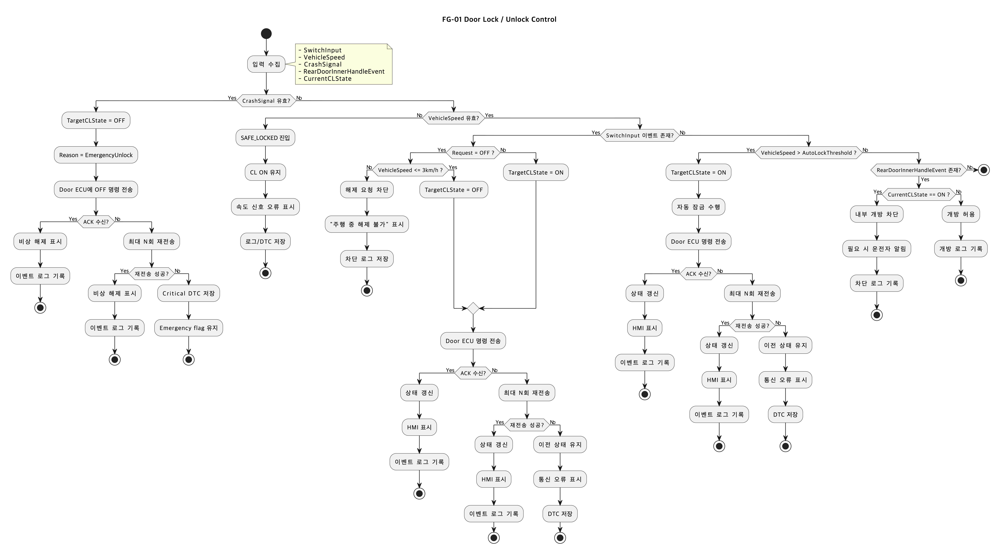

# 📘 SwDD - Electronic Child Lock System 상세 설계서

## 1. 설계 개요
본 문서는 전자식 차일드락 시스템의 상세 소프트웨어 설계를 정의한다.
기존 Use Case(UC-1 ~ UC-7), Sequence Diagram, State Diagram, Failure Mode 분석 결과를 기반으로 다음 두 핵심 기능을 상세 설계한다.

* **FG-01. 도어 잠금/해제 제어 (Door Lock / Unlock Control)**
* **FG-02. 하차 안전 보조 (Exit Safety Assist)**

**[안전 설계 핵심 정책]**
1. 사고 발생 시 무조건 Unlock 수행
2. 전원 OFF 또는 리셋 후에는 직전 상태를 복구
3. 주행 중(차량 속도 > `3km/h`) 차일드락 해제 요청은 차단
4. 센서 오류 또는 속도 신호 오류 시 Safe State = `` `SAFE_LOCKED` (CL ON 유지) ``
5. 충돌 유효 검출 시 Safe State = `` `EMERGENCY_RELEASED` (비상 해제) ``

---

## 2. 기능 리스트 (기능 분할)
| Feature Group | 기능명 | 관련 UC |
| :--- | :--- | :--- |
| **FG-01** | 도어 잠금/해제 제어 | UC-1, UC-2, UC-3, UC-4 |
| **FG-02** | 하차 안전 보조 | UC-5, UC-6, UC-7 |

---

## 3. 기능별 상세 정의

### 3.1 FG-01 도어 잠금/해제 제어
**기능 설명:** 운전자 입력, 차량 속도, 충돌 신호, 뒷좌석 내부 핸들 이벤트를 기반으로 차일드락 상태를 제어하고 도어 ECU에 제어 명령을 전달한다. 예외 상황에서는 Safe State 또는 직전 상태 복구 정책을 적용한다.

**하위 기능 정의:**
| Function ID | Function Name | 설명 | Input | Output |
| :--- | :--- | :--- | :--- | :--- |
| **F-01** | `InputMonitorAndValidator` | 스위치 입력, 속도, 충돌 신호, 내부 핸들 이벤트를 수집하고 유효성 검증 수행 | `SwitchInput`, `VehicleSpeed`, `CrashSignal`, `RearDoorInnerHandleEvent`, `IgnitionState` | `ValidSwitchInput`, `ValidSpeed`, `ValidCrashSignal`, `EventFlags`, `FaultFlags` |
| **F-02** | `ChildLockStateDecision` | 현재 상태와 입력 조건을 기반으로 목표 차일드락 상태를 결정 | `ValidSwitchInput`, `VehicleSpeed`, `ValidCrashSignal`, `CurrentCLState`, `FaultFlags` | `TargetCLState`, `DecisionReason`, `SafetyAction` |
| **F-03** | `DoorEcuCommandHandler` | 도어 ECU 제어 명령 전송 및 ACK 확인, 재전송 수행 | `TargetCLState`, `DecisionReason`, `DoorECUAck` | `ChildLockCommand`, `AckStatus`, `RetryStatus`, `DTC` |
| **F-04** | `RearDoorOpenBlockHandler` | CL ON 상태에서 뒷좌석 내부 개방 요청을 차단 | `RearDoorInnerHandleEvent`, `CurrentCLState`, `DoorStateFeedback` | `OpenRequestBlock`, `DriverNotice`, `BlockResult` |
| **F-05** | `StatePersistenceManager` | 전원 종료 전 상태 저장, 리셋 후 상태 복구 및 재동기화 | `IgnitionOffEvent`, `IgnitionOnEvent`, `ResetEvent`, `CurrentCLState` | `SavedCLState`, `RestoredCLState`, `RestoreStatus` |
| **F-06** | `HmiAndEventLogger` | 상태 표시, 경고 표시, 이벤트 및 오류 로그 저장 | `MessageId`, `WarningLevel`, `EventType`, `DTC`, `CurrentCLState` | `HMIOutput`, `EventLog`, `DTCStore` |

### 3.2 FG-02 하차 안전 보조
**기능 설명:** 후방 위험 접근 감지, 뒷좌석 점유 상태, 시동 OFF 이벤트를 기반으로 하차 안전을 보조한다. 위험 감지 시 차일드락을 자동 유지/활성화하고, 필요 시 운전자에게 경고 또는 상태 알림을 제공한다.

**하위 기능 정의:**
| Function ID | Function Name | 설명 | Input | Output |
| :--- | :--- | :--- | :--- | :--- |
| **F-07** | `RearRiskEvaluation` | 후방 접근 객체의 거리/상대속도/지속시간을 바탕으로 위험도 판단 | `RearObjectDistance`, `RearObjectRelSpeed`, `SensorHealth`, `SensorConfidence` | `RiskHigh`, `RiskLevel`, `RiskValid`, `FaultFlag` |
| **F-08** | `RearRiskProtectionController` | 후방 위험이 높을 경우 차일드락 유지/활성화 및 운전자 경고 수행 | `RiskHigh`, `CurrentCLState`, `IgnitionState` | `TargetCLState`, `WarningMessageId`, `WarningSound`, `EventLog` |
| **F-09** | `RearSeatOccupancyAlert` | 출발 시 뒷좌석 점유 여부와 CL 상태를 확인하여 권장/상태 알림 제공 | `DepartureEvent`, `RearSeatOccupancy`, `CurrentCLState`, `HMIHealth` | `AlertType`, `AlertMessageId`, `EventLog` |
| **F-10** | `IgnitionOffStatusAlert` | 시동 OFF 시 CL ON 상태를 1회 요약 알림 | `IgnitionOffEvent`, `CurrentCLState`, `ActiveHMIAlert`, `HMIHealth` | `StatusSummaryMessage`, `AlertPriority`, `EventLog` |

---

## 4. 설계 파라미터
| Parameter | 설명 | 값 / 정책 |
| :--- | :--- | :--- |
| `UNLOCK_INHIBIT_SPEED` | 주행 중 해제 차단 속도 기준 | `3 km/h` |
| `AUTO_LOCK_SPEED_THRESHOLD` | 자동 잠금 활성화 속도 기준 | 차량 설정값 |
| `MAX_ECU_RETRY` | Door ECU 명령 재전송 횟수 | `N회` |
| `HMI_ALERT_ONCE` | 상태/권장 알림 1회 표시 제한 | `1회` |
| `SPEED_SIGNAL_TIMEOUT` | 속도 신호 유효성 확인 제한시간 | 설정값 |
| `REAR_RISK_THRESHOLD` | 후방 위험 감지 임계치 | 거리 + 상대속도 + 지속시간 조합 |
| `SAFE_STATE_SENSOR_FAULT` | 센서/속도 오류 시 안전 상태 | `SAFE_LOCKED (CL ON 유지)` |
| `SAFE_STATE_CRASH` | 충돌 시 안전 상태 | `EMERGENCY_RELEASED (CL OFF)` |

---

## 5. 핵심 기능 상세 설계

### 5.1 FG-01 도어 잠금/해제 제어

#### 5.1.1 주요 입력 / 출력
**Input:**
* `SwitchInput`
* `VehicleSpeed`
* `CrashSignal`
* `RearDoorInnerHandleEvent`
* `IgnitionState`
* `DoorECUAck`
* `CurrentCLState`

**Output:** 
* `ChildLockCommand`
* `OpenRequestBlock`
* `HMIOutput`
* `EventLog`
* `DTC`

#### 5.1.2 결정 노드 정의
| Decision ID | 조건 | 의미 |
| :--- | :--- | :--- |
| **D1** | `CrashSignal is valid?` | 유효한 사고/충돌 상황인지 판단 |
| **D2** | `VehicleSpeed is valid?` | 속도 신호 정상 여부 판단 |
| **D3** | `SwitchInput event exists?` | 운전자 전자식 버튼 입력 여부 |
| **D4** | `Request = OFF ?` | 운전자가 차일드락 해제를 요청했는지 |
| **D5** | `VehicleSpeed <= 3 km/h ?` | 주행 중 해제 허용 여부 판단 |
| **D6** | `VehicleSpeed > AUTO_LOCK_SPEED_THRESHOLD ?` | 출발/주행 중 자동 잠금 조건 판단 |
| **D7** | `RearDoorInnerHandleEvent exists?` | 뒷좌석 내부 개방 시도 여부 |
| **D8** | `CurrentCLState == ON ?` | 현재 차일드락 ON 상태인지 |
| **D9** | `DoorECUAck received?` | 도어 ECU 응답 여부 |

#### 5.1.3 Safe State 정의
| Safe State | 진입 조건 | 소프트웨어 동작 |
| :--- | :--- | :--- |
| `SAFE_LOCKED` | 속도 신호 오류, 상태 불일치, 제어 불확실성 | `ChildLockState = ON 유지`, 해제 요청 차단, 경고 표시, 로그/DTC 저장 |
| `EMERGENCY_RELEASED` | 유효한 충돌 감지 | `ChildLockState = OFF`, 비상 해제 명령 최우선 수행 |
| `STATE_RESTORE` | IGN 리셋 또는 재부팅 | NVM에서 직전 상태 복구 후 Door ECU와 재동기화 |

#### 5.1.4 Flow Chart (도어 잠금/해제 제어)

---

### 5.2 FG-02 하차 안전 보조

#### 5.2.1 주요 입력 / 출력
**Input:** 
* `RearObjectDistance`
* `RearObjectRelSpeed`
* `SensorHealth`
* `SensorConfidence`
* `RearSeatOccupancy`
* `DepartureEvent`
* `IgnitionOffEvent`
* `CurrentCLState`
* `HMIHealth`
* `ActiveHMIAlert`

**Output:** 
* `TargetCLState`
* `WarningMessageId`
* `WarningSound`
* `AlertMessageId`
* `StatusSummaryMessage`
* `EventLog`
* `DTC`

#### 5.2.2 결정 노드 정의
| Decision ID | 조건 | 의미 |
| :--- | :--- | :--- |
| **D1** | `Rear sensor valid?` | 후방 위험 센서 정상 여부 판단 |
| **D2** | `RiskHigh?` | 거리 + 접근속도 + 지속시간 기준 위험 여부 판단 |
| **D3** | `CurrentCLState == OFF ?` | 현재 차일드락 OFF 상태인지 |
| **D4** | `DepartureEvent occurred?` | 출발 상태 진입 여부 |
| **D5** | `RearSeatOccupancy == TRUE ?` | 뒷좌석 점유 여부 |
| **D6** | `IgnitionOffEvent occurred?` | 시동 OFF 이벤트 여부 |
| **D7** | `CurrentCLState == ON ?` | 시동 OFF 시 CL ON 상태인지 |
| **D8** | `HighPriorityHMIAlert exists?` | 다른 경고와 충돌 여부 |
| **D9** | `HMIHealth is valid?` | HMI 채널 정상 여부 |

#### 5.2.3 Safe State 정의
| Safe State | 진입 조건 | 소프트웨어 동작 |
| :--- | :--- | :--- |
| `SAFE_LOCKED` | 후방 센서 오류, 위험 판단 불확실, HMI/센서 오류 중 보호 필요 시 | `ChildLockState = ON 유지`, 최소 경고 또는 오류 알림, 로그 저장 |
| `ALERT_ONCE_POLICY` | UC-6/UC-7 알림 중복 가능성 | 알림 1회 제한, 중복 억제, 우선순위 제어 |
| `HMI_WATCHDOG_FALLBACK` | HMI 응답 지연/실패 | 대체 채널 경고 시도 또는 로그 저장 후 종료 |

#### 5.2.4 Flow Chart (하차 안전 보조)

---

## 6. Failure Mode 반영 요약
| Failure Mode | 검출 위치 | 소프트웨어 대응 | Safe State |
| :--- | :--- | :--- | :--- |
| **주행 중 해제 요청** | FG-01 / D5 | 해제 차단, 경고 표시, 로그 저장 | 현재 CL 유지 (실질적으로 CL ON 유지) |
| **속도 신호 오류** | FG-01 / D2 | 속도 유효성 실패 시 보호 우선 | `SAFE_LOCKED` |
| **Door ECU ACK 미수신** | FG-01 / D9 | 최대 N회 재전송, 실패 시 이전 상태 유지, DTC 기록 | 이전 안전 상태 유지 |
| **충돌 유효 감지** | FG-01 / D1 | 비상 해제 명령 최우선 수행 | `EMERGENCY_RELEASED` |
| **후방 센서 오류** | FG-02 / D1 | 기능 제한, CL ON 유지, 오류 알림 | `SAFE_LOCKED` |
| **HMI 응답 지연/실패** | FG-02 / D9 | 1회 표시 보장, 실패 시 로그 저장 | `HMI_WATCHDOG_FALLBACK` |
| **전원 리셋/IGN 재기동** | FG-01 / F-05 | NVM 복구 후 상태 재평가, Door ECU와 동기화 | `STATE_RESTORE` |

---

## 7. UC 추적성
| UC | 반영된 상세 설계 기능 |
| :--- | :--- |
| **UC-1** 운전자 전자식 ON/OFF 제어 | F-01, F-02, F-03, F-05, F-06 |
| **UC-2** 차량 출발 시 자동 활성화 | F-01, F-02, F-03, F-06 |
| **UC-3** 사고 발생 시 자동 해제 | F-01, F-02, F-03, F-06 |
| **UC-4** 뒷좌석 내부 문 열기 시도 차단 | F-01, F-04, F-06 |
| **UC-5** 후방 위험 접근 보호 | F-07, F-08, F-03, F-06 |
| **UC-6** 뒷좌석 점유 + 출발 시 알림 | F-09, F-06 |
| **UC-7** 시동 OFF 시 상태 알림 | F-10, F-05, F-06 |

---

## 8. 구현 시 고려 사항
* **상태 전이 우선순위:** `CrashSignal` > `Sensor Fault` / `Speed Fault` > `Driver Input` > `Auto Lock`
* **알림 우선순위:** 위험 경고(Hazard) > 상태 알림(Status)
* **재시도 정책:** Door ECU 제어 명령은 최대 N회 재전송
* **중복 알림 방지:** UC-6, UC-7은 1회 표시 정책(`HMI_ALERT_ONCE`) 적용
* **상태 복구:** IGN OFF 시 현재 CL 상태 저장
* **동기화:** IGN ON / Reset 시 NVM 복구 후 상태 동기화
